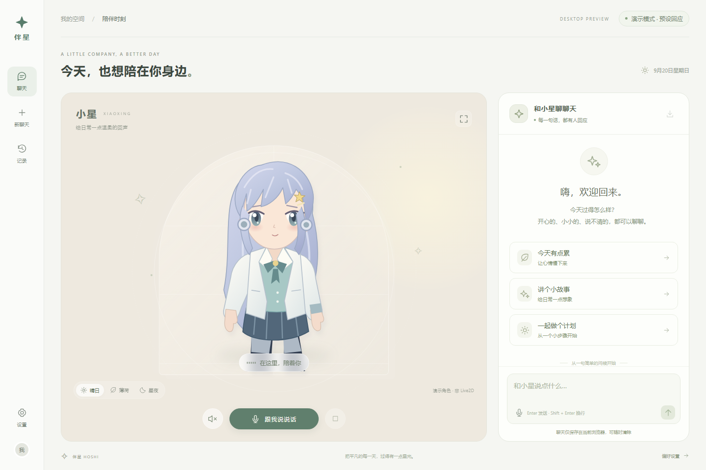

# P01 桌面原型交接

负责人：A0。日期：2026-09-20。分支：`agent/P01-desktop-prototype`。本报告记录本机验证；GitHub 工作流以实际运行记录为准。

## 可体验结果

“伴星 HOSHI”桌面网页提供原创 SVG 演示角色、三种场景、触摸招呼、视线跟随与眨眼、流式文字、中文系统朗读、实际音量口型、显式打断、语音输入入口、本机聊天记录及导出删除。默认回应为预设，界面持续标注；云端模型适配器仅在显式配置后启用。

启动：按 [桌面说明](../../development/DESKTOP_PROTOTYPE.md) 安装依赖后运行 `pnpm dev:desktop`。本次不需要 Mac。

## 实测范围

测试环境为当前 Windows 开发机，Node 24.19.0、Python 3.12.10、pnpm 11.19.0、uv 0.12.17。浏览器回归使用独立的 Playwright Chromium 153.0.8010.12，无用户登录或个人历史。截图检查覆盖 1440×960 与 390×844 窗口；窄窗口检查只是布局验证。

系统语音实际检测到 Microsoft Huihui Desktop（zh-CN）及 Microsoft Zira Desktop（en-US）。中文示例“你好，我是小星，很高兴认识你。”经真实 API 返回 199516 字节 WAV，单声道 22050 Hz，时长 4.52 秒。浏览器实际解码播放后采样到口型输入大于 0.04；点击停止后采样归零、播放状态结束。

已运行 7 条浏览器流程：

- 初始页面、角色互动、场景切换及刷新保留。
- 真实本机 API 对话、完成后刷新恢复、新建与选择历史、导出及确认删除。
- 流式输出中停止；新会话收到自身回复，旧记录不再增加文字。
- Windows 实际音频播放驱动嘴型；停止后回到待机。
- 浏览器语音服务无响应时退出“准备开口”，明确提示，可继续文字聊天。
- API 离线及模拟麦克风拒绝权限的明确反馈。
- 名称与语速设置、沉浸模式退出、窄窗口无水平溢出。

回归期间发现“文本完成后立即刷新，可能只保存到空的 pending 消息”；已修复为完成与停止时立即保存，并在页面离开时保存部分文本，相关完整流程重跑通过。

24 项服务测试覆盖预设流、请求边界、Host / Origin 限制、密钥不泄漏、错误配置、云端 SSE 解析及中断、上游 401/429/坏数据、系统音色缺失和合成子进程取消释放。云端上游使用 httpx MockTransport；不会生成费用。全仓固定工具与契约校验、Python 检查、五个 workspace 类型检查、网页构建和两端手机 JS bundle 通过。结果另见 [verification.json](verification.json)。

沿用 T00 的 Starlette / HTTPX 弃用提示和 React Native 内部导出的解析回退提示；检查退出码为 0。手机 JS bundle 通过不代表原生构建通过。

## 限制与后续派工

- 演示角色是 SVG，不是 Live2D；下一步由 T09 接入有合法来源的模型与 Cubism viewer。
- 没有实际云服务密钥，本次不声称真实模型对话已验证；T05 负责 provider 选择及真实中文质量、用量和时延验收。
- 没有开启用户麦克风录音。真实识别质量、噪声、扬声器回声与自动插话需要后续实测；当前是单次识别、确认发送和显式停止。
- 整段文字完成后才合成 WAV，不是低延迟流式 TTS；字幕先显示完整文本，不是逐句播放对齐。AC04/AC05/AC06/AC09 未按 R1 数量和性能标准验收。
- 非 Windows 的浏览器语音回退没有真实波形口型；实体 Mac 和手机没有参与本次运行。
- 一浏览器内的取消隔离不是跨设备租约。当前没有账号、数据库、长期记忆、直播、OBS 页面、安装包或后台监听。
- 用户请求清除的是当前浏览器聊天，既有导出文本及其他浏览器空间不受此操作影响。

接口与根依赖变更由 A0 负责。临时 `/prototype/*` 与冻结契约隔离；`contracts` 内容和基线哈希未改。详情见 [ADR14](../../adr/0014-desktop-prototype-first.md)。原任务台账保持，T00 的外部验证未关闭。
