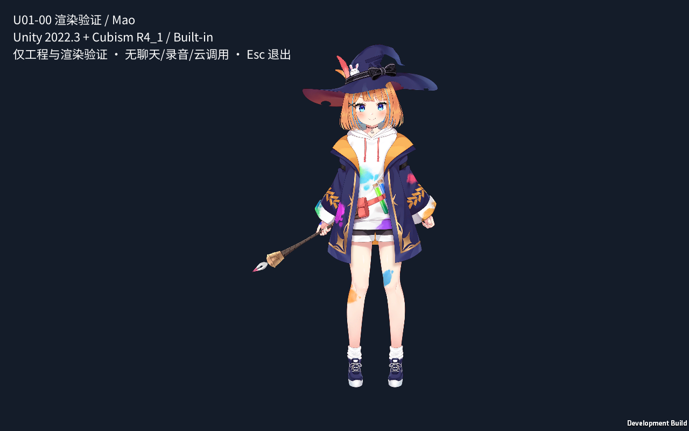

# U01-00：Unity 2022 / R4_1 正式迁移交接

日期：2026-09-20。基础工程已从干净提交恢复、导入、编译并构建真实 Windows Player；同一完整程序包完成 600.025 秒图形运行，无运行错误，19 阶段 × 10 轮验证完成。UA01 开发验证通过；UA02 的基础渲染子项已有证据，完整 UA02、U-G0 及版本/共享边界冻结仍交 A0 决定。[原 Draft PR #3](https://github.com/L1nkkkk/ai-companion/pull/3) 继续使用。

## 固定版本与提交

- **实际 built/tested source：`849c6c982d875f477d88933af4abea5a163d0fa6`**。报告作为后续独立提交，不把报告提交冒充已构建代码。干净复现目录始末均为该 SHA，构建前后 Git 无修改。
- 设计依据：`000f2b7776abb9a87e63337eb6df4b7b0fcd5fa7` / [ADR16](../../../adr/0016-unity-2022-r41-fallback-validation.md)。R1/R2 已由设计提交 `5286a56` 关闭；本次未改 `Test-Player.ps1`。
- Unity `2022.3.62f3c1 / 1623fc0bbb97`，Windows x64 / Mono / D3D11 / Built-in；完整官方 Cubism `5-r.4.1`、Core `5.1.0`、同包 Mao；TMP `3.0.6`、uGUI `1.0.0`、Noto Sans CJK SC static `2.004`。
- [资源清单](../../../../assets/manifest/unity-foundation.json) 固定原包、文件、模型、Core 与字体哈希。[获取说明](../../../../apps/unity/README.md) 提供精确官方 Editor 入口和恢复/构建/启动命令；完整安装器尚未下载校验，没有安装器 SHA，也未完成第二台机器安装。

## 干净构建与程序包

在 `U01-00-r41-reproduction` 全新 detached worktree 中，从空下载缓存获取资源，首次导入前不存在 Library。1022 个官方文件逐项哈希匹配；原包另外 4 个 csc/mcs 编译响应文件及 meta 按清单排除。没有复制实验 Library 或混合 R5。正常构建使用已提交场景和真实生成的 ProjectSettings、包锁、meta。

实际 Editor 导入并编译 `Companion.Contracts` 与工程，Windows 构建成功，Unity BuildReport 用时 15.578 秒（不含首次导入和打包），0 errors / 2 warnings。警告来自官方 SDK `CubismMotion3Json.cs:439` 的 CS0162，以及无图形 Editor 无法更新环境/反射探针；场景使用 Unlit 材质，实际 D3D11 Player 另行验证。完整信息见 [构建结果](fallback-r41/formal/unity-build-result.json) 与[过滤日志](fallback-r41/formal/build-windows-filtered.txt)。

Windows ZIP：`C:/Users/linkkzhu/Desktop/Projs/Neuro-Saki/U01-00-r41-validation/Windows-x64.zip`，50,352,471 字节，SHA-256：

```text
8c59e9c54cb89e5dafac2027fc8bdfa1ce53bd0c5a93f889435d15361bd8a6db
```

[原始构建清单](fallback-r41/formal/build-receipt.json) 与[实际运行清单](fallback-r41/formal/runtime-manifest.json) 的完整文件列表一致，运行结束后已逐项重新计算包内文件哈希；不能只用 Unity 启动 exe 的哈希识别应用。ZIP 包含依赖与 SDK/Core/字体许可说明。构建清单 `playerStarted=false` 是构建时状态，后续启动由独立运行清单证明，不篡改原始记录。

Editor 导入会重序列化部分官方 prefab/动画/fade 资源；[导入后审计](fallback-r41/formal/post-import-audit.json) 列出实际变化，避免把“恢复前原包字节一致”说成“导入后所有文件都没变”。自有源码/场景/settings 的 Git 始终干净。SDK C#/shader/Core 保持官方字节。

## 600 秒实际运行

在登记的 Windows 11 / Core Ultra 7 265 / RTX 5060 设备上，以 1280×800 可见窗口运行同一完整包。外部监督实际墙钟 604.076 秒，退出码 0；600+30 秒外部时限未触发。Player 自报 600.025 秒，errors=0、warnings=0、unsupportedMaterials=0。

| 指标 | 实测 |
|---|---:|
| 单调时钟帧间隔样本 | 35,811 |
| P95 / 最大帧间隔 | 17.452 / 64.100 ms |
| ≤33.3 ms 帧占比 | 99.9860% |
| ≥1000 ms 帧间隔 | 0 |
| OS 工作集峰值 | 462.88 MiB |
| 约 30 秒工作集基线 / 结束工作集 | 251.89 / 462.88 MiB |
| 工作集增量 | 210.98 MiB |
| 5 秒采样私有内存 / Unity 分配峰值 | 457.04 / 67.86 MiB |

帧样本排除启动前 3 秒，未截断；[frame-times.csv](fallback-r41/formal/frame-times.csv) 已独立统计核对。该数值是 Unity Update 的真实时钟间隔，包含运行期间截图等测试开销，不等于 GPU 时间或完整桌面 UI 输入延迟，也不能据此宣布完整 UI 无阻塞。内存来自 Windows GetProcessMemoryInfo；OS 工作集峰值与每 5 秒采样的 private/Unity 分配峰值语义不同。本次数据不证明长期无内存增长。

## 动作、参数与画面证据

19 阶段每 60 秒循环，实际 10 完整轮、190 个阶段样本，失败 0；TapBody[0] 与 special_01 共 20 次非循环动作均观察到 SDK begin/end 回调。21 张真实截图包括首轮全部 19 阶段及 3/10 秒全景；后续轮用数据与动作回调验证，并未截图每一帧。完整 JSON 与 CSV：[行为记录](fallback-r41/formal/behavior-summary.json)、[阶段数据](fallback-r41/formal/behavior-stages.csv)。

| 阶段 | 样本数 | 相对中性姿态变化的 drawable 数范围 |
|---|---:|---:|
| idle | 10 | -1–163 |
| neutral | 10 | 0–0 |
| mouth-open | 10 | 13–13 |
| mouth-closed | 10 | 0–0 |
| left-eye-closed | 10 | 13–13 |
| right-eye-closed | 10 | 13–13 |
| both-eyes-closed | 10 | 26–26 |
| eyes-open | 10 | 0–0 |
| breath-low | 10 | 0–0 |
| breath-high | 10 | 156–156 |
| breath-wave | 10 | 156–156 |
| look-left | 10 | 93–93 |
| look-right | 10 | 93–93 |
| look-up | 10 | 93–93 |
| look-down | 10 | 93–93 |
| look-center | 10 | 0–0 |
| greeting-tapbody-0 | 10 | 163–163 |
| mask-stress-special-01 | 10 | 190–190 |
| return-idle | 10 | 163–163 |

提交的参数代理值、延迟后异步 Core 几何数据、实际 PNG 分别记录；不宣称三者是精确同帧配对。首次 idle 尚无中性参照，几何计数 -1 表示未建立参照，不是错误。

独立审图和集成审图可见嘴张合、左右单眼/双眼闭合、左右头部/视线变化、上下较细微姿态、TapBody 动作和特效，未见明显粉色缺材质、眼睛虹膜泄漏、透明矩形或部件错层。特效截图的发光外缘靠近/触及上沿并与测试文字重叠，不能据该图证明特效外缘完全无裁切；细微呼吸不能单靠静帧证明连续性。中文静态标签显示正常，不代表 TMP 聊天/IME/DPI 验收。

模型共 262 drawables、37 带遮罩、10 反向遮罩。Core 可见标记/opacity 联集观察到 32/37 遮罩、8/10 反向遮罩；未观察到的分别为 `ArtMesh274, ArtMesh273, ArtMesh256, ArtMesh193, ArtMesh192`、`ArtMesh193, ArtMesh192`。Core 标志不等于实际屏幕像素贡献，计数和选取截图不证明所有正反遮罩路径正确。



## 共享接口与未覆盖范围

纯 C# [Companion.Contracts](../../../../apps/unity/Assets/Companion/Runtime/Contracts/README.md) 已真实编译，包含六模块接口、不可变 DTO、八类事件、身份与 PCM 生命周期，无 Unity/Cubism/HTTP 业务依赖。UI 的音量、设置、设备/音色、历史列表/导出统一走 Session。README 登记十类待 A0 最终冻结的局部字段选择及 Transport→Audio 验证器注入路线；这些成员名不是新增 wire schema。此次没有实现 Session/网络/音频/历史业务或完成线程/取消/校验接线。

直接 ParamA 开合不是实际音频口型；fixture 的 greeting 是官方 TapBody[0]/mtn_02 映射候选，官方并未将该动作命名为招呼。自然眨眼、鼠标跟随、用户招呼入口、缺参数模型降级、生产 AvatarPresenter、输出音量联动、中文 IME、录音、历史与云闭环仍留给对应 owner。因此完整 UA02 和 UA03–12 未在本轮判为通过，U-G0 未放行。

## 证据与复核

[verification.json](verification.json) 为当前验收索引；[environment.json](environment.json) 与[build-manifest.json](build-manifest.json) 已指向此次 R4_1 正式验证。原 R5 阶段顶层 JSON 归档于 `fallback-r41/history-r5/`，原环境失败报告和短时实验记录保留为历史，不能代表新包状态。

[验证摘要](fallback-r41/formal/verification-summary.json) 记录干净目录始末 SHA、原始私有日志哈希和测量限制；[分发清单](fallback-r41/artifacts.json) 记录本地完整程序包及全部截图/CSV/JSON/过滤日志证据 ZIP 的位置和 SHA-256。原始 Editor/Player 日志留在本机，仓库只发布筛选诊断，避免带出许可与机器标识。仓库文本复制规范为 UTF-8 LF；`evidence-hashes.json` 对应原始本地证据，不冒充规范化副本的字节哈希。

完整仓库基础检查在源码提交上通过，见[检查日志](fallback-r41/formal/foundation-check.txt)。此次是本机新目录复现，不是第二台机器 QA；独立静态审查和真实截图复核已完成，最终 A0 版本/接口冻结与验收仍待审。
