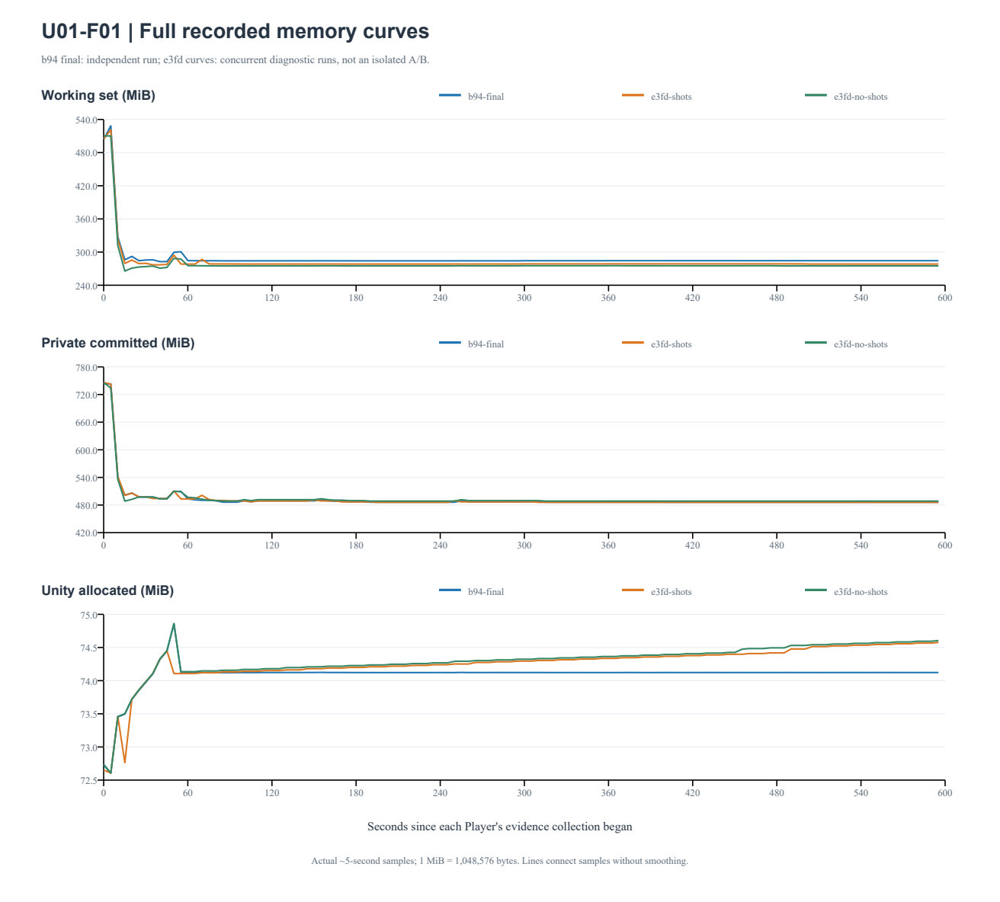
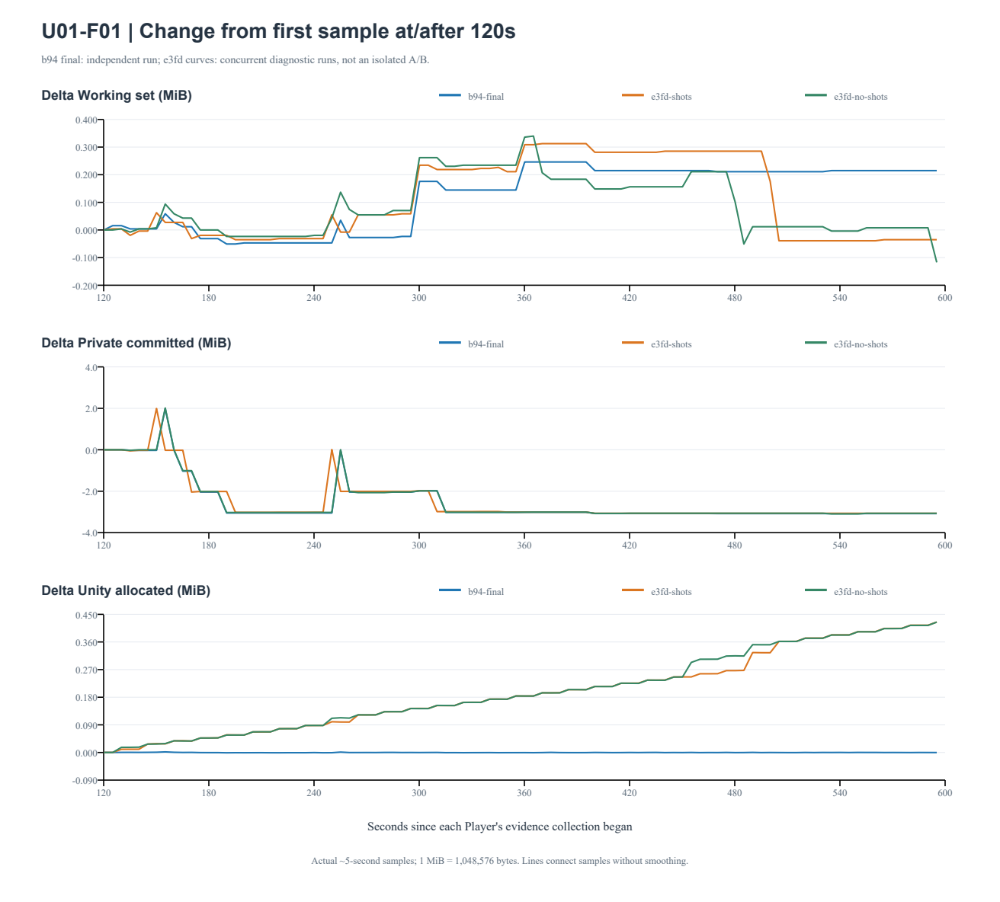

# U01-F01：发布动作集的内存与帧时间验证

2026-09-21，最终候选源码 `b94af81d73101d684b856bd0942de778ea74074a`。本报告评价当前 Windows / Mao / neutral、idle、TapBody[0] 招呼及固定演示脚本；不单独宣布完整 U-G0 或 UA11 通过。精确构建来源见 [build-manifest.json](build-manifest.json)，实测环境见 [environment.json](environment.json)。

最终实际 Player 正常退出 0，运行 **600.013 秒**、完成 **38 次招呼**。此前 SDK 连续 Play 保留旧节点的问题已有可复现定位并在自有 Avatar 层修复：最终逐帧最大节点数 **6**，120 个五秒样本仅出现 **4 / 6**。120 秒之后 Unity 分配在 **74.121534–74.124416 MiB** 内波动，末值相对基线 **−0.000220 MiB**，没有重现旧版本逐轮上升。该发布 workload 的十分钟内存曲线与动作图上界验证完成；这不是对所有场景或所有泄漏的排除。

原始 35,813 个帧间隔重算：P95 **16.8914 ms**、最大 **32.3072 ms**，**100% ≤ 33.3 ms**，没有 ≥1 秒间隔。脚本完成，20 次有声停止、10 次接受前取消、一次文字模式、22 次实际播放开始 / 一次完整播放结束均有记录；错误 0、警告 0、失败列表为空。此处满足该设备与发布动作集的帧间隔指标，不替代物理 UI 输入延迟测量。

## 对象与测量方法

| 运行 | 源码 | 条件与用途 |
| --- | --- | --- |
| `desktop-b94af81-600` | `b94af81` | 修复后的独立 600 秒；包内 Python、启动器、后台和实际 Player，1280×800，开启 3 次截图；无第二个 Player 或 Unity Editor 构建。前 90 秒另有指定进程 WASAPI 录制，详见 [音频回环报告](qa-loopback.md) |
| `desktop-final-600` | `e3fd507` | 修复前，截图开启，3 张图；仅定位基线 |
| `desktop-final-600-noscreens` | `e3fd507` | 修复前，截图关闭；与上一组并行、共享 fixture 后台，独立历史，启动错开约 31.57 秒；仅定位基线 |

三组均为相同发布动作与固定演示流程：一次完整语音输出、20 次实际有声音频中停止、10 次接受前立即取消、文字模式、历史导出、音量/静音，然后约每 15 秒招呼。后半段是本地动作循环，没有不断追加聊天或新字形；不能等同于连续 600 秒云端业务或多轮 ASR。音频为有来源的测试 WAV，文字为明确标记的固定回复。

机器为 Windows 11 Pro 10.0.26200、i7-12700KF、RTX 5060 Ti；Unity 2022.3.62f3c1、Mono、D3D11 / Built-in、Cubism 5-r.4.1、Core 5.1.0。采样只读取目标 Player，不把后台、录制器或 Editor 的内存加到 Player 上。

- 每约 5 秒记录工作集、私有内存和 `Profiler.GetTotalAllocatedMemoryLong()`，1 MiB = 1,048,576 bytes。工作集是当前驻留物理内存，私有值是进程私有提交量；Unity 值是其分配器池内的已分配量，三者不能相加，也不能互相代替。[Windows 定义](https://learn.microsoft.com/en-us/windows/win32/api/psapi/ns-psapi-process_memory_counters_ex)、[Unity 定义](https://docs.unity3d.com/2022.3/Documentation/ScriptReference/Profiling.Profiler.GetTotalAllocatedMemoryLong.html)。
- 30 / 60 / 120 秒基线均取该时刻之后第一个实际样本，不插值。固定分段比较首末差值、中位数和波动范围；另比较 120–180 秒与末 60 秒窗口。OLS 与 Theil–Sen 斜率仅描述已观察曲线，不做显著性判断或长期外推。
- 五秒采样峰值可能遗漏瞬时峰值。`peakWorkingBytes` 是 OS 进程生命周期工作集高水位；`peakPrivateBytes` 是采样最大私有值；`finalWorkingBytes` 是末次采样值，均不视为退出释放后的内存。
- 帧时间从原始 `frame-times.csv` 按最近秩法重算，统计初始化后三秒之外的实际 Update 间隔；不是 GPU 耗时或物理输入响应时间。内存 CSV 和帧 CSV 均检查时间单调、样本完整性以及与最终结果的数量一致性。

## 修复前曲线与可复现原因

修复前两组都采到 120 个内存样本，运行约 600 秒，无探针错误、警告或脚本失败。预热后的 Unity 分配仍逐步上升，说明不能仅凭工作集回落写成“无泄漏”：

| `e3fd507` 运行，120 秒后至末次样本 | 工作集变化 MiB | 私有变化 MiB | Unity 分配变化 MiB | Unity OLS MiB/分钟 |
| --- | ---: | ---: | ---: | ---: |
| 截图开启 | −0.0352 | −3.0664 | +0.4250 | +0.0531 |
| 截图关闭 | −0.1172 | −3.0664 | +0.4246 | +0.0544 |

SDK 源码中 `CubismMotionLayer.PlayAnimation` 断开旧 mixer 后新建 `CubismMotionState`，没有销毁旧 playable；`StopAllAnimation` 同样只断开。完整 graph 由 `CubismMotionController.OnDisable` 销毁。[Disconnect](https://docs.unity3d.com/2022.3/Documentation/ScriptReference/Playables.PlayableGraph.Disconnect.html) 与 [DestroyPlayable](https://docs.unity3d.com/2022.3/Documentation/ScriptReference/Playables.PlayableGraph.DestroyPlayable.html) 是不同生命周期操作，不能把断开视为释放。

真实 Unity Editor / 未修改 SDK 的独立计数探针确认：初始 2 个节点，连续 64 次 Play 后为 130，StopAll 后仍为 130；64 次 graph 重建后旧图均失效，每次 greeting → idle 最大 6，FadeController 的层数组和缓存引用仍一致。见 [探针源码](check-motion-graph.cs) 与 [原始结果和 SDK 文件哈希](motion-graph-check.json)。探针在 Edit Mode 未自动派发生命周期时显式调用真实方法（共 130 次）；它证明 SDK 分配与引用行为，不能替代真实 Player 或可见淡入效果。

修复只在自有 `MaoAvatarPresenter.Greet` 中重置 motion 组件，再播放招呼并回到 idle；SDK、正式契约及冻结依赖未修改。当前公布的两段动作使 graph 上限为 6；最终 Player 每帧记录最大值，另把节点计数写入五秒曲线。重建不保留上轮 fade 上下文，本结论不扩展到任意连续动作混合，视觉体验仍按发布动作的实际检查处理。

旧两组有并行负载、共享后台和后期 Editor 工作，不能作为严格隔离的截图 A/B，不能用两条曲线相减估计截图内存成本。UTC 文件记录：Check08 约 `17:54:43–17:54:49`，graph 探针 `17:55:08–17:55:15`，新包构建 `17:55:40–17:55:51`；均为 2026-09-20 UTC，落在旧测后段，随后还有新包短暂关窗测试。共享后台在第一组结束后关闭，第二组最后约 32 秒仅继续本地招呼。两组仍表明“关闭截图就消失”不是此处持续节点积累的充分解释；具体修复依据是 SDK 计数复现和后续独立 Player 上界。

## 最终独立 600 秒曲线

最终 120 个内存样本覆盖 **0.077335–595.228474 秒**，相邻间隔中位数 **5.000837 秒**、最大 **5.015896 秒**；末次样本距结束约 4.784 秒。数据单调、无缺采警告，帧 CSV 数量与 Player 汇总一致。末值为工作集 **284.386719 MiB**、私有 **486.175781 MiB**、Unity 分配 **74.122344 MiB**。

| 基线 → 末次样本 | 实际基线秒 | 工作集变化 MiB | 私有变化 MiB | Unity 分配变化 MiB |
| --- | ---: | ---: | ---: | ---: |
| 30 秒后 | 30.111991 | −1.238281 | −11.257813 | +0.144694 |
| 60 秒后 | 60.117580 | −0.062500 | −7.164063 | −0.001182 |
| 120 秒后 | 120.142424 | +0.214844 | −3.078125 | −0.000220 |

30–60 秒仍有聊天、音量/静音与截图活动，不能把其中的短时增长当作稳定状态。全程采样工作集峰值 **528.363281 MiB**，OS 工作集高水位 **530.171875 MiB**；私有采样峰值 **743.152344 MiB**，Unity 分配采样峰值 **74.856461 MiB**。这些峰值均与后期曲线分开呈现。

下表是每段实际样本的最小–最大值，不拼接成每次招呼的精确周期；120 秒后的各段均为 24 个样本，60–120 秒为 12 个样本：

| 时间段 | 工作集范围 MiB | 私有范围 MiB | Unity 分配范围 MiB |
| --- | ---: | ---: | ---: |
| 60–120 秒 | 284.105469–284.449219 | 486.246094–493.339844 | 74.120070–74.123526 |
| 120–240 秒 | 284.121094–284.230469 | 486.203125–491.242188 | 74.121534–74.124416 |
| 240–360 秒 | 284.125000–284.347656 | 486.203125–489.230469 | 74.121657–74.123752 |
| 360–480 秒 | 284.382813–284.417969 | 486.175781–486.242188 | 74.121894–74.122836 |
| 480 秒至末次样本 | 284.382813–284.386719 | 486.175781–486.175781 | 74.122152–74.122809 |

末 60 秒窗口（540.216–595.228 秒）的工作集和私有值分别恒定在 284.386719 / 486.175781 MiB，Unity 分配范围仅 **0.000454 MiB**。与 120–180 秒首个窗口的中位数比较，三指标分别变化 **+0.207031 / −3.050781 / −0.000416 MiB**；两窗口不重叠。120 秒后 Unity 的 OLS / Theil–Sen 描述斜率分别为 **−0.00000285 / +0.00003950 MiB/分钟**，与修复前每分钟约 +0.054 MiB 的持续台阶增长不同。工作集仍有小台阶，但末段稳定，不能因工作集与 Unity 曲线不同就把两者混作同一内存指标。

完整可复算指标、每段首末/中位数/范围、固定 15 秒时间块、原始结果与文件哈希见 [memory-analysis.json](memory-analysis.json)，三组绘图数据见 [memory-samples.csv](memory-samples.csv)。图以各进程自身采样开始作为零点，无平滑；旧两组的干扰条件已在前文声明，叠图不增加因果结论。

最终原始文件 SHA-256：

| 文件 | SHA-256 |
| --- | --- |
| `memory-avatar.csv` | `deefa99a8da4fb8d36e3b2a56c8da0bea76a29b7da3ee50e406bc125c139da0d` |
| `frame-times.csv` | `b24f99a08dcdd7b02c0b255074876befa0292c706e79fea894b849656e7e8d5e` |
| `player-result.json` | `9b51d15ce46a9fbf167f9e07c07c2716fe56816dbbf75e21436ad764b7704f16` |

## 验证边界与证据位置

原始 U01-F01 针对 Foundation 测试的 30 秒工作集 251.89 MiB → 结束 462.88 MiB、增长 210.98 MiB。本轮发布动作集与旧 Foundation 的完整动作扫掠不同；即使定位到了实际节点积累，也不能把旧 210.98 MiB 全部归因于它。本报告提供当前发布范围的定位、修复与固定 workload 复测，不补造原测试缺失的曲线。

采样初始化发生在模型/UI 加载之后，没有加载前的完整基线。截图路径在编码后销毁临时纹理，但只有文件 UTC 写入时间，没有逐次单调时钟开始/结束标记。模型销毁位于退出流程，采样已结束，没有释放后的三指标测量。这些观测缺口明确保留；正常关窗写队列通过也不等于证明释放后的内存回收。

单独的 `desktop-b94af81-close` 在实际有声输出后调用 `Application.Quit`，通过正常 wantsToQuit 路径，6.567 秒退出 0；历史写入中断及 12,288 / 192,000 样本，播放开始 1 次、完成 0 次，错误/警告 0。它是程序触发的正常关闭证据，不是手动 Alt+F4，也不是上述缺失的模型释放后采样。

本轮没有严格隔离的修复后无截图对照、任意中文字符扩张测试、其他模型测试、OS 125% / 150% DPI 矩阵、第二台机器复现或 UA11 的 30 分钟混合业务长测；不声称排除了所有内存问题。原验收没有任意 MiB 的硬阈值，本报告未临时发明一个阈值来宣布通过。

原始目录均位于 `C:/Users/Link/Dev/ai-companion-dev-tools/evidence/`，名称见上表；各目录包含 `memory-avatar.csv`、`frame-times.csv`、`player-result.json` 和实际截图。Editor 探针另见 `desktop-motion-graph-check.json`，执行日志位于 `../builds/desktop-graph-check-evidence/Check.log`。分析只读取性能记录与截图元数据，不包含用户历史、凭据或音频正文。
