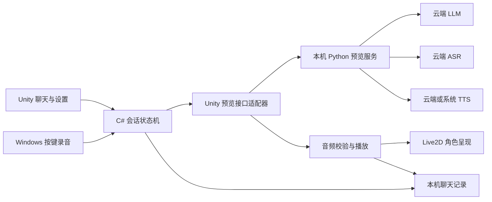

# U01 · Unity 桌面 Live2D 伙伴原型任务书

版本：1.2。日期：2026-09-20。设计与最终验收：A0。实现：用户另行启动的开发会话。

**目标：交付一个可独立启动的 Windows Unity 程序，使用真实 Live2D 演示模型，完成文字或按键语音输入、云端对话、声音播放、实际音量口型和随时打断。**

本文是开发任务书。U01-00 基础工程已按 [A0 第三轮验收](../../reports/U01/acceptance/PR-003-round3-review.md)通过，版本和共享 C# 边界已冻结；U01-01 至 U01-04 为 ready，可由独立开发会话领取。首轮 R1/R2 保持关闭。完整 UA02 和 U-G0 尚未通过，内存/遮罩/取景等后续项须按验收记录处理。

[ADR16](../../adr/0016-unity-2022-r41-fallback-validation.md)固定 Unity `2022.3.62f3c1` + Cubism `5-r.4.1` + BiRP；[CSHARP-BASELINE](CSHARP-BASELINE.md)固定接口和 Transport→Audio 验证器注入。被测源码为 `849c6c9`，后续开发从含报告的 `cfffbf6` 起步，再合入最新验收设计提交，记录精确 SHA；无需重做 U01-00 选型。

## 1. 使用这份任务书

按顺序阅读 [ADR15](../../adr/0015-unity-client-and-design-only-a0.md)、[ADR16 条件回退](../../adr/0016-unity-2022-r41-fallback-validation.md)、本文、[接口约定](INTERFACES.md)、[验收表](ACCEPTANCE.md)、[派工提示](DISPATCH.md)。机器可读台账是 [unity-desktop.json](../../blueprint/planning/unity-desktop.json)。官方来源与版本说明见 [SOURCES.md](SOURCES.md)。

本工作包从 main 基线 `0bfc133` 独立形成。开发起点必须包含 ADR15：先取得 `design/unity-desktop-taskbook`，在交接记录中写明其精确提交 SHA；合并后可使用包含相同设计的 main 提交。不要直接从历史 P01 网页分支继续做客户端。

A0 在本会话写设计、检查证据和提出返工项。开发 owner 在另一会话创建工程和提交实现；集成 owner 在开发会话解决代码冲突与构建问题。文档中的“应实现”“应测试”都不是 A0 现在开始实现的指令。

## 2. 范围与三个交付门槛

| 门槛 | 用户得到的体验 | 判定 |
|---|---|---|
| U-G0：角色原型 | Windows `.exe` 中的真实 Live2D 模型可眨眼、呼吸、跟随视线；点击招呼；播放随包测试音频并驱动口型 | 可以先交用户体验；必须显示“测试音频 / 演示”，不称为 AI 对话完成 |
| U-G1：文字陪伴 | 输入中文，后台实际调用云端 LLM，Unity 展示回复并朗读；能立即打断、改音量、查看或删除本机历史 | 必须有真实云调用与声音证据；TTS 可以先用明确标注的本机系统音色 |
| U-G2：按键语音 | 按住说话、松开识别，检查转写文字再发送；云端 ASR、对话、播放、打断闭环可用 | 通过真实麦克风样本和权限、设备故障测试后，U01 才整体完成 |

无密钥或预算时，继续交付 U-G0、接口 mock 和故障处理；U-G1 / U-G2 保留 `awaiting_external`。预设回应、模拟转写或本地固定 WAV 不得作为真实云端闭环证据。

本次包括：窗口化桌面 App、单角色、单本机会话播放、中文聊天、按钮与 Esc 停止、简单表情、音色与音量设置、本机历史、日志与 Windows 测试分发包。

本次不包括：手机安装包与后台监听、灵动岛、直播弹幕、OBS 专用显示端、透明桌宠窗口、置顶穿透、多设备接管、账号同步、长期记忆、唤醒词、自动插话、商店发布。原 R1 需求保留，分别进入后续任务。

## 3. 技术与资源基线

| 项目 | 设计选择 | 首次开发的必交证据 |
|---|---|---|
| 客户端 | Unity / C#，Windows x86_64 Standalone；普通窗口；uGUI + TextMeshPro，使用可分发的中文字体 | 独立 Player 启动、中文输入法、字体来源与缺字检查 |
| Unity | 已冻结 `2022.3.62f3c1` / `1623fc0bbb97`，Windows x64 Mono / D3D11 | 同机干净源码导入构建与 600 秒基础渲染已验收；后续所有 agent 共用同一确切版本 |
| Live2D | 正式 R4_1 / Core 5.1.0 / BiRP；原 R5 / URP 仅保留历史；不混用资源或选 alpha / beta | SDK / Core / 管线与实际解析的包版本、来源和 SHA-256、材质/遮罩/排序的 Player 证据 |
| 演示模型 | 从官方样例中选一款许可适用且有口型、眨眼参数的模型；没有指定美术角色 | 模型名称、下载地址、具体适用条件、文件哈希、支持参数与动作映射；不假定所有官方样例同一许可 |
| 后台 | 现有 Python / FastAPI 工具基线；新增隔离的 Unity 预览模块 | 受控 fixture 与真实 provider 两条路径，模式在 UI 中可见 |
| 语音 | Unity 桌面音频输出；前景按键录音；LLM / ASR 由后台调用云服务，TTS 可云端或 Windows 系统语音 | 实际音频格式、取消证据、设备信息和真实服务使用量 |
| 持久化 | Unity 本机应用数据目录中的带版本 JSON；对话与设置分开 | 原子写入、损坏恢复、导出删除、容量限制；不得写进 Git 工作目录 |

**版本冻结点是 U01-00。** 开发集成 owner 先在工程内写入候选版本并生成真实依赖锁，用于导入和构建；提交固定源码与证据，经 A0 复核后才成为后续协作的冻结版本。实验包锁不能直接当作正式提交的复现证据；其他并行任务不得自行升级。

保留 `.meta` 并启用文本序列化。Unity `Library/`、`Temp/`、`Logs/`、`Obj/`、`UserSettings/`、构建输出与用户数据不提交。模型、纹理及 SDK 二进制按实际许可与大小选择可提交资源或固定版本获取说明；需要 LFS 时连同配额与克隆验证一起登记。不能用只在作者机器存在的绝对路径代替资源交付。

## 4. 架构与执行边界



- `Session` 唯一管理当前请求、状态与取消代数。UI 只发命令、订阅状态，不直接操纵 provider 或模型参数。
- `Transport` 隔离临时协议与未来 R1 协议。JSON 解析、网络与 WAV 解码不长时间阻塞 Unity 主线程；Unity 对象操作回到主线程。
- `Playback` 唯一拥有播放设备和队列。角色振幅取自实际播放路径，包含静音、音量与停止影响；收到文字、下载进度或 TTS 完成不意味着正在说话。
- `Avatar` 只消费动作、表情和音量，不调用云端、不播放第二份音频。参数缺失降级为中性状态并记录一次诊断，不重复报错刷屏。
- `History` 区分生成文字与已播状态。音频模式中取消时，不能把未播完的全文作为“她已经说过”送入下一轮上下文；可保守排除被中断的 assistant 文本，保留用户消息与中断标记。用户明确关闭朗读时，完整显示并正常结束的文字可作为下一轮上下文，标记为 displayed，而非 played。
- 手机后续实现以原生服务接管音频和连接。Unity 前台只订阅快照；`runInBackground` 不能当作 iOS / Android 后台能力证明。

### 状态与取消规则

可见状态：`Offline`、`Ready`、`Recording`、`Transcribing`、`Thinking`、`PreparingSpeech`、`Speaking`、`Error`。`Stopping` 只能是短暂本地过渡，不等待云端确认才结束声音。

停止顺序：本机立即停止 AudioSource / 清空待播数据 / mouth=0 → 增加本地取消代数并标记 request_id → 关闭正在录制的麦克风与请求 → 尽力通知后台取消。所有异步回调同时检查请求 ID 和代数；旧文本、转写、WAV、表情和完成事件均丢弃。

以下操作复用同一停止入口：停止按钮、Esc、新发送、新会话、切换历史、清空记录、关闭窗口。失去焦点时结束按键录音，防止“没收到松键”造成持续采集；播放是否在窗口失焦后继续由桌面设置明确显示。本版不自动启动下一次录音。

连续双击发送不能造成两次相同云调用。点击停止后无需后台连接即可静音。后台断线、provider 超时、找不到麦克风、音频格式错误、SDK 或模型缺失都必须对应明确状态与可操作提示。

## 5. 交互要求

默认窗口 1280×800，支持至少 960×640 与 125% / 150% Windows 缩放。左侧角色，右侧聊天，下方输入和说话、停止、音量控件；模式标签持续区分 fixture、真实云端对话、系统语音、云端语音。

首次启动不录音、不自动收费调用。先检查模型与本机后台；缺模型显示获取说明，后台未连显示重试入口，缺 provider 配置显示具体缺项。云端密钥只在后台配置，Unity 设置中不提供 provider 密钥字段。

支持中文 IME，Enter 发送但输入法组词期间不误发送，Shift+Enter 换行。语音按钮采用按住录音、松开停止；最多 30 秒；转写进入可编辑输入框，用户确认发送。录音中显示持续计时，松开、失焦、停止和关闭窗口都释放麦克风。

自动朗读开关、音量、模型名称与模式可见；音量变化即时影响当前输出和口型。系统未支持的表情或动作不显示为成功。新会话停止旧回复；历史至少支持最近 20 个会话、每个最近 80 条，导出当前会话、单会话删除和全部清除。达到上限时告知清理策略。

## 6. 目录与协作所有权

以下为待开发的目标目录，当前文档提交不创建这些工程文件：

```text
apps/unity/Assets/Companion/Runtime/Contracts/  C# 边界类型，集成 owner 单写
apps/unity/Assets/Companion/Runtime/UI/         聊天与设置
apps/unity/Assets/Companion/Runtime/Avatar/     Live2D 参数与动作适配
apps/unity/Assets/Companion/Runtime/Session/    状态机、历史和取消
apps/unity/Assets/Companion/Runtime/Transport/  临时协议与未来正式协议适配
apps/unity/Assets/Companion/Runtime/Audio/      播放、采样、录音
apps/unity/Assets/Companion/Scenes/            总场景，集成 owner 单写
apps/unity/Assets/Companion/Prefabs/           子模块 prefab，各自 owner
apps/unity/Assets/Companion/Tests/             EditMode / PlayMode
apps/unity/Packages/                          依赖与锁，集成 owner 单写
apps/unity/ProjectSettings/                   工程设置，集成 owner 单写
services/api/app/unity_preview/               本机 Unity 预览接口
services/api/app/providers/                   可复用云端适配器
services/api/tests/unity_preview/             服务协议、取消与错误测试
assets/manifest/                             SDK、模型、字体来源与哈希
tools/unity/                                 构建与开发启动工具
docs/reports/U01/                            模块交接、缺陷、验收证据
```

使用小粒度 assembly definition；角色、播放、UI 不互相硬引用实现。并行 agent 交付 prefab / 组件及接线说明，由集成 owner 修改总场景；禁止多人同时改同一个 `.unity`、共享 prefab、ProjectSettings 或包锁。

共享类型和接口先由开发 owner 提案，A0 评审设计，集成 owner 在开发会话落地。服务入口注册、Python 锁、`.gitignore`、资源清单与 CI 的写入 owner 在开工卡中登记；A0 的设计批准不等于 A0 在当前会话替他们改代码。

## 7. 子任务与并行顺序

| 子任务 | owner 职责 | 前置 | 修改范围 | 必交结果 |
|---|---|---|---|---|
| U01-00 工程与版本验证 | Unity 集成 owner | 此任务书 | 工程骨架、共享类型、ProjectSettings、Packages、资源清单、构建工具 | 固定版本建议、SDK 示例实际导入、最小 Windows Player、C# 边界与构建步骤；交 A0 评审 |
| U01-01 角色呈现 | 角色 owner | U01-00 通过 | Avatar、角色 prefab、对应测试、模型清单条目 | 真实模型、参数映射、眨眼呼吸、视线、招呼、情绪降级；以测试音频驱动口型 |
| U01-02 桌面 UI 与历史 | UI owner | U01-00 通过 | UI、History（位于 Session 下）、UI prefab、对应测试 | 中文输入、控件、模式与错误状态、本机记录、删除导出；使用受控假服务独立验证 |
| U01-03 本机后台与云适配 | 后台 owner | U01-00 通过；官方资料和样例设计可提前准备 | unity_preview、providers、对应服务测试；已登记的入口和根 Python 依赖 | fixture / cloud LLM、TTS、ASR 能力、取消、资源上限、预算与超时；真实服务证据或准确缺口 |
| U01-04 会话、传输与音频 | 客户端音频 owner | U01-00 通过 | Session（排除 History）、Transport、Audio、对应测试 | 状态机、请求隔离、实际 WAV 播放与口型输入、取消、PTT 录音、无设备处理；对 fixture 联调 |
| U01-05 分阶段集成与打包 | Unity 集成 owner | U01-01/02/03/04 的对应阶段交接 | 总场景、接线、构建工具、已登记的共享配置 | 分别产出 U-G0 / U-G1 / U-G2 候选包，不以 mock 越过真实云阶段 |
| U01-06 独立测试与交接 | QA owner | 对应候选包 | 测试工具、报告、缺陷单 | 按验收表真实执行，向实现 owner 派回缺陷；同一提交复测并整理证据 |
| U01-07 设计与最终验收 | A0，本会话 | U01-06 证据及修复复测 | 设计、台账、验收结论 | 逐项判定通过/不通过/待外部条件，决定阶段可交付程度；不代写修复 |

并行建议：先由单个 Unity 集成 owner 完成 U01-00；后台 owner 可同时准备接口样例设计与 provider 选型，不自行改接口。U01-00 评审后，角色、UI、客户端音频三个 owner 可并行，后台开始实现。资源有限时一个开发会话顺序承担多个角色即可。

U01-03 的资料研究和样例设计允许先准备；领取实现与客户端联调前依赖 U01-00 的冻结记录。U01-05 / 06 按门槛迭代，不等云端密钥才交付 U-G0，也不把 U-G0 标成 U01 整体完成。

## 8. 内部边界与临时服务

[INTERFACES.md](INTERFACES.md) 是此原型的接口语义基线。U01-00 把边界映射为 C# 类型并交审，U01-03 把临时 HTTP 协议变成可验证 schema 和固定样例。新增 schema 位于预览模块的测试/协议目录，不能偷偷加入或改写冻结的 `contracts/`。

未来迁入正式 R1 时：Transport 替换为受认证的 REST / WSS 客户端；请求代数映射到正式 epoch / turn；整段 WAV 替换为有界 PCM 分段；本机历史迁移需明确用户动作；移动端音频接口替换为原生引擎。UI 和 Avatar 不因 provider 变化重写。

## 9. 交付物与复现

每个 owner 交付：任务 ID、起点与最终提交、允许/实际修改目录、测试命令与原始结果、具体运行环境、截图或录像、依赖与许可证来源、已知限制、复现步骤、下一 owner 所需信息。

集成交付必须包含：Unity 源工程、固定资源获取步骤、可运行 Windows x64 ZIP（`.exe` 及完整依赖目录）、构建日志、包 SHA-256、版本清单、后台启动/停止说明、fixture 模式、真实云配置样例和无密钥时的行为。后台可由单独终端启动；此阶段不强制打包 Python 或制作安装器。普通体验者运行 Player 不需要 Unity Editor，使用本机后台仍需文档指定的 Python 环境。

Unity 构建产物放测试分发附件或批准的存储位置，不提交大型 ZIP 到源码仓库。CI 的普通文本或服务测试不能代替 Unity Player；Unity 构建需要有效构建环境，若 CI 尚无授权资源，可提交开发机 batchmode/Editor 构建日志和真实 Player 证据，准确标注执行地点。

首个开发会话使用 [U01-00 提示](DISPATCH.md)。完整验收以 [ACCEPTANCE.md](ACCEPTANCE.md) 为准。

## 10. 外部输入与当前状态

| 输入 | 已知状态 | 缺失时推进方式 |
|---|---|---|
| Windows 开发机 | 已完成固定版本的同机干净构建和 600 秒基础验证 | 模块可按冻结起点开发；第二机器获取和复现另有待办 |
| 演示模型 | 用户同意演示角色；原候选与回退实验均选各自官方包内 Mao | 分别登记资源条件、哈希与实际能力，不按同名沿用清单 |
| 云服务 | 用户倾向云端 AI；服务商、密钥、预算、音色待登记 | 完成 fixture 和故障路径；真实门槛不虚报通过 |
| Mac / 手机 | 用户有 M4 MacBook Pro，目前暂不参与 | Windows 原型独立推进，移动任务后续恢复 |
| 开发会话 | U01-00 已验收关闭，U01-01 至 04 可领取 | A0 提供任务与验收；仅按用户启动的会话实际派工 |
